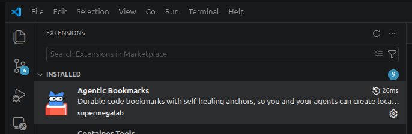
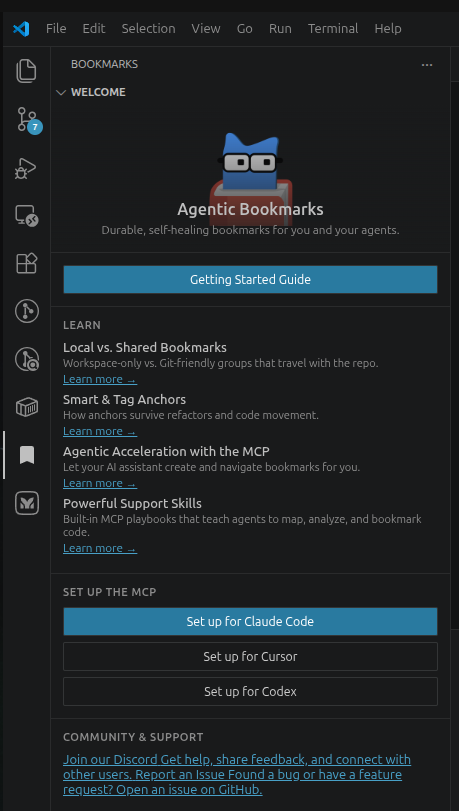
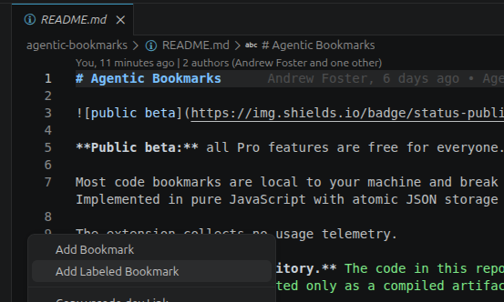
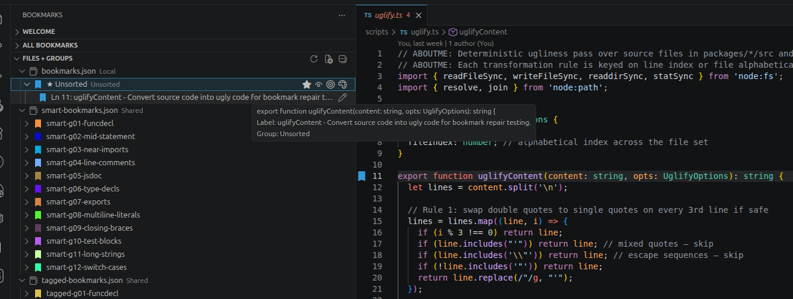
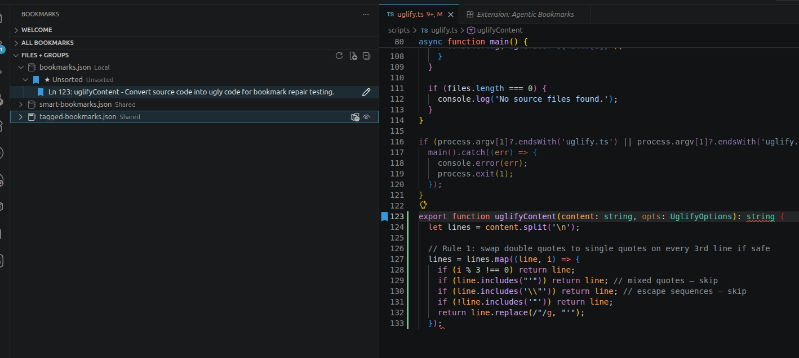

<!-- ABOUTME: User-facing getting started guide for Agentic Bookmarks. -->
<!-- ABOUTME: Covers install, MCP setup, bookmark placement, refactor survival, and AI skill playbooks. -->

# Getting Started with Agentic Bookmarks

Agentic Bookmarks gives you durable, self-healing bookmarks that survive refactors — and lets
your AI assistant create, navigate, and manage them through a bundled MCP server.

This guide takes you from install to your first agent-accessible bookmark in about two minutes.

---

## 1. Install

Search for **"Agentic Bookmarks"** in the VS Code Extensions panel (`Cmd+Shift+X` / `Ctrl+Shift+X`)
and click **Install**. Publisher: **supermegalab**.

---

## 2. Set up the MCP for your AI assistant

Open the **Agentic Bookmarks** panel (the bookmark icon in the Activity Bar) and click the
setup button for your tool:

- **Set up for Claude Code** — runs `claude mcp add`. Choose Local (this project) or User (all projects).
- **Set up for Cursor** — writes `.cursor/mcp.json` (Project) or `~/.cursor/mcp.json` (Global).
- **Set up for Codex** — writes `.codex/config.toml` (Project) or `~/.codex/config.toml` (Global).

This also adds `.bookmarks/local/` to your `.gitignore` if it isn't there already.

**Verify it's working:** ask your assistant "List my bookmarks" — it should respond (even if the list is empty).

---

## 3. Place your first bookmark

Open any file. Right-click the **line number** (the gutter) and choose **Add Labeled Bookmark**.

Type a label — "auth boundary", "main render loop", "the 3am hack" — and press Enter.

A pin appears in the gutter and the bookmark shows up in the **Agentic Bookmarks** sidebar.

Your agent can now see this bookmark too. Try: **"What bookmarks are in this file?"**

---

## 4. Watch it survive a refactor

Rename the function your bookmark is on — or move a few lines somewhere else in the file.

Click the bookmark in the sidebar. It navigates to the **correct code** at its new location.

The bookmark stores surrounding context to re-find its line as code drifts. Small edits —
renames, insertions, formatting passes — don't break it.

---

## 5. Navigate and search

Click any bookmark in the sidebar to jump to it. Use the search input at the top of the panel
to filter by label, group, or tag.

---

## What's Next: AI Skill Playbooks

Once the MCP is set up, ask your AI assistant to use these built-in playbooks:

| Playbook | What it does |
|---|---|
| `bookmarks://skill/map-codebase` | Build a complete bookmark map of the whole repo |
| `bookmarks://skill/add-to-system` | Deeply bookmark one module or feature area |
| `bookmarks://skill/add-to-files` | Annotate specific files you're already reading |
| `bookmarks://skill/analyze` | Review coverage, staleness, and themes in your bookmarks |

Or just ask your assistant: **"Map this codebase with bookmarks"** — it knows what to do.

---

## Get Help

- **Discord** (fastest): https://discord.gg/zukZdvqf8q
- **GitHub Issues**: https://github.com/super-mega-lab/agentic-bookmarks/issues/new
- **Email**: contact@supermegalab.com
